from pysss import password

# The Python Tutorial

Python是一种易于学习且功能强大的编程语言。它具有高效的高级数据结构，以及一种简单但有效的面向对象(OOP)编程方法。Python优雅的语法和动态类型，再加上其解释性特性，使其成为在大多数平台上许多领域进行脚本编写和快速应用程序开发的理想语言。

Python解释器及其广泛的标准库可以从Python官方网站（https://www.python.org/） 免费获取，以源代码或者二进制形式提供，适用于所有的主要平台，并且可以自由分发。该网站还包含许多免费的第三方Python模块、程序和工具的分发版本及链接，以及额外的文档。

Python解释器也可以轻松地通过用C或C++（或其他可从C调用的语言）实现的新函数和数据类型进行扩展。Python也是和作为可定制应用程序的扩展语言。

本教程以非正式的方式向读者介绍Python语言和系统的基本概念和特性。手边有一个Python解释器会很有助于实践体验，但所有示例都是自包含的，因此本教程也可以离线阅读。

要了解标准对象和模块的描述，请参阅《Python标准库》。 《Python语言参考》提供了对语言的更正式定义。要用C或C++编写扩展，请阅读《扩展和嵌入Python解释器》和《Python/C API参考手册》。 还有几本深入介绍Python的书籍。

本教程并非旨在覆盖Python的每一个功能，甚至也不是每一个常用功能。相反，它介绍了Python许多最值得注意的特性，让你对这门语言的风格和特点有一个很好的了解。读完之后，你将能够阅读和编写Python模块和程序，并且准备好进一步学习《Python标准库》中描述的各种Python模块。

术语表也值得一看.

# Python 3.13 教程目录

## 1. 开胃菜 (Whetting Your Appetite)

## 2. 使用 Python 解释器 (Using the Python Interpreter)
- 2.1 调用解释器 (Invoking the Interpreter)
- 2.2 解释器及其环境 (The Interpreter and Its Environment)

## 3. Python 简介 (An Informal Introduction to Python)
- 3.1 使用 Python 作为计算器 (Using Python as a Calculator)
  - 3.1.1 数字 (Numbers)
  - 3.1.2 字符串 (Strings)
  - 3.1.3 列表 (Lists)
- 3.2 迈出编程第一步 (First Steps Towards Programming)

## 4. 更多控制流工具 (More Control Flow Tools)
- 4.1 `if` 语句 (if Statements)
- 4.2 `for` 语句 (for Statements)
- 4.3 `range()` 函数 (The range() Function)
- 4.4 `break` 和 `continue` 语句，以及循环中的 `else` 子句 (break and continue Statements, and else Clauses on Loops)
- 4.5 `pass` 语句 (pass Statements)
- 4.6 `match` 语句 (match Statements)
- 4.7 定义函数 (Defining Functions)
- 4.8 更多关于定义函数的内容 (More on Defining Functions)
  - 4.8.1 默认参数值 (Default Argument Values)
  - 4.8.2 关键字参数 (Keyword Arguments)
  - 4.8.3 特殊参数 (Special Parameters)
  - 4.8.4 任意参数列表 (Arbitrary Argument Lists)
  - 4.8.5 解包参数列表 (Unpacking Argument Lists)
  - 4.8.6 Lambda 表达式 (Lambda Expressions)
  - 4.8.7 文档字符串 (Documentation Strings)
  - 4.8.8 函数注解 (Function Annotations)
- 4.9 插曲：编码风格 (Intermezzo: Coding Style)

## 5. 数据结构 (Data Structures)
- 5.1 更多关于列表的内容 (More on Lists)
  - 5.1.1 将列表用作栈 (Using Lists as Stacks)
  - 5.1.2 将列表用作队列 (Using Lists as Queues)
  - 5.1.3 列表推导式 (List Comprehensions)
  - 5.1.4 嵌套列表推导式 (Nested List Comprehensions)
- 5.2 `del` 语句 (The del Statement)
- 5.3 元组与序列 (Tuples and Sequences)
- 5.4 集合 (Sets)
- 5.5 字典 (Dictionaries)
- 5.6 循环技巧 (Looping Techniques)
- 5.7 更多关于条件的内容 (More on Conditions)
- 5.8 比较序列和其他类型 (Comparing Sequences and Other Types)

## 6. 模块 (Modules)
- 6.1 更多关于模块的内容 (More on Modules)
  - 6.1.1 以脚本方式执行模块 (Executing Modules as Scripts)
  - 6.1.2 模块搜索路径 (The Module Search Path)
  - 6.1.3 “编译” Python 文件 (“Compiled” Python Files)
- 6.2 标准模块 (Standard Modules)
- 6.3 `dir()` 函数 (The dir() Function)
- 6.4 包 (Packages)
  - 6.4.1 从包中导入 * (Importing * From a Package)
  - 6.4.2 包内引用 (Intra-Package References)
  - 6.4.3 多目录中的包 (Packages in Multiple Directories)

## 7. 输入与输出 (Input and Output)
- 7.1 格式化输出 (Fancier Output Formatting)
  - 7.1.1 格式化字符串字面量 (Formatted String Literals)
  - 7.1.2 字符串的 format() 方法 (The String format() Method)
  - 7.1.3 手动格式化字符串 (Manual String Formatting)
  - 7.1.4 旧式字符串格式化 (Old String Formatting)
- 7.2 读写文件 (Reading and Writing Files)
  - 7.2.1 文件对象的方法 (Methods of File Objects)
  - 7.2.2 使用 json 保存结构化数据 (Saving Structured Data with json)

## 8. 错误与异常 (Errors and Exceptions)
- 8.1 语法错误 (Syntax Errors)
- 8.2 异常 (Exceptions)
- 8.3 处理异常 (Handling Exceptions)
- 8.4 抛出异常 (Raising Exceptions)
- 8.5 异常链 (Exception Chaining)
- 8.6 用户定义的异常 (User-defined Exceptions)
- 8.7 定义清理操作 (Defining Clean-up Actions)
- 8.8 预定义清理操作 (Predefined Clean-up Actions)
- 8.9 在异常后执行代码 (Running Code After an Exception)

## 9. 类 (Classes)
- 9.1 关于名称和对象的说明 (A Word About Names and Objects)
- 9.2 Python 作用域与命名空间 (Python Scopes and Namespaces)
  - 9.2.1 作用域与命名空间示例 (Scopes and Namespaces Example)
- 9.3 初识类 (A First Look at Classes)
  - 9.3.1 类定义语法 (Class Definition Syntax)
  - 9.3.2 类对象 (Class Objects)
  - 9.3.3 实例对象 (Instance Objects)
  - 9.3.4 方法对象 (Method Objects)
- 9.4 随机说明 (Random Remarks)
- 9.5 继承 (Inheritance)
  - 9.5.1 多重继承 (Multiple Inheritance)
- 9.6 私有变量 (Private Variables)
- 9.7 杂项 (Odds and Ends)
- 9.8 迭代器 (Iterators)
- 9.9 生成器 (Generators)
- 9.10 生成器表达式 (Generator Expressions)

## 10. 标准库简介 (Brief Tour of the Standard Library)
- 10.1 操作系统接口 (Operating System Interface)
- 10.2 文件通配符 (File Wildcards)
- 10.3 命令行参数 (Command Line Arguments)
- 10.4 错误输出重定向与程序终止 (Error Output Redirection and Program Termination)
- 10.5 字符串模式匹配 (String Pattern Matching)
- 10.6 数学 (Mathematics)
- 10.7 互联网访问 (Internet Access)
- 10.8 日期与时间 (Dates and Times)
- 10.9 数据压缩 (Data Compression)
- 10.10 性能测量 (Performance Measurement)
- 10.11 质量控制 (Quality Control)
- 10.12 自带电池 (Batteries Included)

## 11. 标准库简介 - 第二部分 (Brief Tour of the Standard Library — Part II)
- 11.1 输出格式化 (Output Formatting)
- 11.2 模板 (Templating)
- 11.3 使用二进制数据记录布局 (Working with Binary Data Record Layouts)
- 11.4 多线程 (Multi-threading)
- 11.5 日志 (Logging)
- 11.6 弱引用 (Weak References)
- 11.7 列表操作工具 (Tools for Working with Lists)
- 11.8 十进制浮点运算 (Decimal Floating Point Arithmetic)

## 12. 虚拟环境与包 (Virtual Environments and Packages)
- 12.1 简介 (Introduction)
- 12.2 创建虚拟环境 (Creating Virtual Environments)
- 12.3 使用 pip 管理包 (Managing Packages with pip)

## 13. 下一步做什么？ (What Now?)

## 14. 交互式输入编辑与历史记录替换 (Interactive Input Editing and History Substitution)
- 14.1 制表符补全与历史记录编辑 (Tab Completion and History Editing)
- 14.2 交互式解释器的替代品 (Alternatives to the Interactive Interpreter)

## 15. 浮点运算：问题与限制 (Floating Point Arithmetic: Issues and Limitations)
- 15.1 表示误差 (Representation Error)

## 16. 附录 (Appendix)
- 16.1 交互模式 (Interactive Mode)

---

# 1.开胃菜

这一章是 Python 教程的引言，旨在激发读者对 Python 的兴趣。主要内容包括：

Python 的特点：介绍了 Python 作为一种简单、易学且功能强大的编程语言的优势，适合初学者和专业开发者。
应用场景：Python 可用于快速开发脚本、构建大型应用程序、处理数据、自动化任务等。
学习动机：鼓励读者通过教程探索 Python，强调其“自带电池”（丰富的标准库）和跨平台特性。
目标：为后续章节奠定基础，让读者对 Python 的潜能有个初步印象，而不是深入技术细节。

# 2.使用Python解释器
这一章介绍了如何启动和使用 Python 解释器，是动手操作的第一步。主要内容包括：

## 2.1 调用解释器（Invoking the Interpreter）

启动方式：在命令行输入 python 或 python3（视系统而定）启动解释器。示例：运行后显示版本信息和提示符 >>>。

参数：可以带命令行参数，如 python -c "print('Hello')" 执行单行代码，或 python script.py 运行文件。

交互模式：直接输入代码并立即看到结果，适合实验和学习。

## 2.2 解释器及其环境 (The Interpreter and Its Environment)

输入与退出：输入代码后按回车执行，输入 quit() 或 Ctrl+D（Unix）/Ctrl+Z（Windows）退出。

环境配置：

     PYTHONPATH：设置模块搜索路径，类似于系统 PATH。
     编码：默认使用 UTF-8 处理源代码，支持其他编码（通过文件顶部声明）。

错误处理：解释器会显示语法错误或异常信息，帮助调试。

脚本执行：可以将代码保存为 .py 文件，通过 python 文件名.py 执行。

# 3. Python 简介 (An Informal Introduction to Python)

## 3.1 使用 Python 作为计算器 (Using Python as a Calculator)

### 3.3.1 数字（Numbers）

解释器可以作为一个简单的计算器：你可以在其中输入任何一个表达式，它会返回计算结果。表达式的语法很简单：运算符+、-、* 和 / 可用于执行算术运算；括号 (()) 可用于分组。例如：

```Py
>>> 2+2
4
>>> 50-5*6
20
>>> (50-5*6) / 4
5
>>> 8/5  # 除法返回的是一个浮点数
1.6

```

整数（例如2、4、20）的类型是`int`，带有小数部分（例如5.6、1.6）的类型是`float`。我们将在教程的后续部分详细了解更多关于数字类型的内容。

除法（`/`）总是返回一个浮点数（float）。如果想进行地板除法并得到整数结果，可以使用`//`运算符；如果想计算余数，可以使用`%`运算符：

```Py
>>> 17 / 3
5.666666666666667
>>> 17 // 3
5
>>> 17 % 3
2
>>> 5 * 3 +2 
17
```

在python中，可以使用`**`运算符来计算幂：

```Py
>>> 5 ** 2 
25
>>> 2 ** 7
128
```

等哈（`=`）用于将一个值赋给变量。赋值后，在下一个交互提示符出现之前不会显示任何结果：

```Py
>>> width = 20
>>> height = 5*9
>>> width * height
900
```

如果一个变量未被定义（即未被赋值），尝试使用它会产生错误：
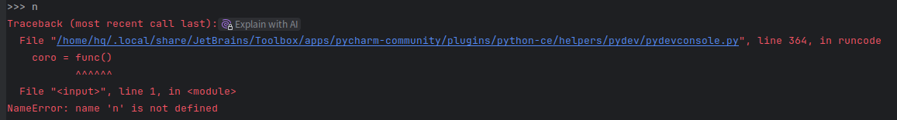

Python完全支持浮点数运算；当运算符的操作数类型混合时，整数操作数会被转换为浮点数：
```Py
>>> 4 * 3.75 - 1
14.0
```
在交互模式下，最后打印的表达式会被赋值给变量`_`。这意味着，当你将Pytho当作桌面计算器是，继续进行计算会变得更加方便，例如：

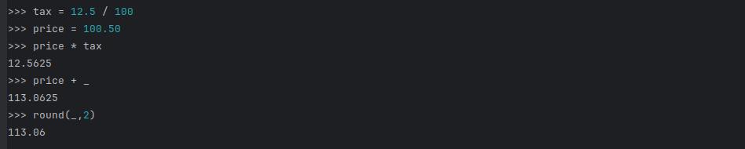

用户应将这个变量是为只读。不要显式地给它赋值-这样做会创建一个同名的独立局部变量，掩盖具有特殊行为的内值变量。

除了支持`int`和`float`，Python还支持其他类型的数字，例如`Decimal`和`Fraction`。Python还内置了对复数的支持，并使用`j`或`J`后缀来表示虚部（`3+5j`）。

### 3.1.2 字符串 (Strings)

Python可以操作文本（由`str`类型表示，称为“字符串”）以及数字。这包括字符“！”、单词“rabbit”、名称“Paris”、句子“Got your back”等等。它们可以用双引号（“...”）或单引号（‘...’）括起来，结果相同。

```Py
>>> 'spam eggs'
'spam eggs'
>>> "Paris rabbit got your back :)! Yay!"
'Paris rabbit got your back :)! Yay!'
>>> '1975'
1975
```
要引用一个引号，我们需要通过在它前面`\`来转移它。或者，我们可以使用另一种类型的引号：

```Py
>>> 'dosen\'t'  
"doesn't"
>>> "dosen't"
"dosen't"
```

在Python shell中，字符串的定义和输出字符串可能看起来不同。`print()`函数会生成更易读的输出，它会省略包围的引号，并打印转义字符和特殊字符：

```Py
>>> s = 'First line. \nSecond line.'
>>> s
'First line. \nSecond line.'
>>> print(s)
First line. 
Second line.
```

如果你不希望以`\`开头的字符被解释为特殊字符，可以通过在第一个引号前添加r来使用原始字符串：
```Py
>>> print('C:\some\name')
C:\some
ame
>>> print(r'C:\some\name')
C:\some\name
```

原始字符串有一个微妙的细节：原始字符串不能以奇数个`\`字符结尾；有关更多信息和解决方法，请参阅FAQ条目。

字符串字面量可以跨越多行。一种方法是使用三重引号："""..."""或'''...'''。行尾字符会自动包含在字符串中，但可以通过在行尾添加\来阻止这种行为。在下面的例子中，初始的换行符不会被包含：

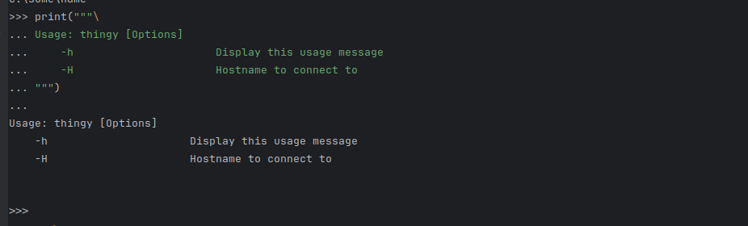

字符串可以用`+`运算符连接，并用`*`运算符重复：

```Py
>>> 3 * 'hq' + 'fp'
'hqhqhqfp'
>>> 'Hq' 'love' 'fp'  # 两个或多个相邻的字符串字面量（即用引号括起来的字符串）会自动连接在一起。
'Hqlovefp'
```
这个特性在你想拆分长字符串时特别有用：

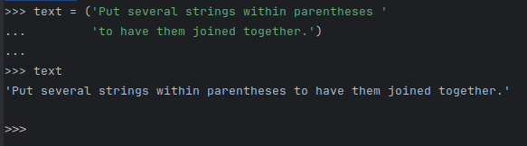

这种连接方式不能用于变量或者表达式，若是想连接可以用`+`

字符串可以被索引（下标访问），第一个字符的索引为0。没有单独的字符类型；一个字符只是一个长度为一的字符串：

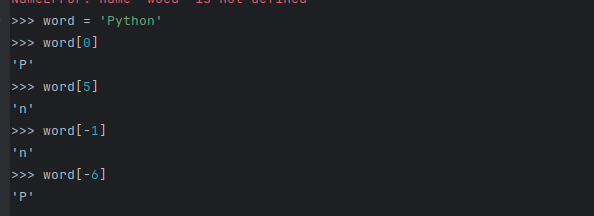

-0也是0,复数索引从-1开始。

字符串除了索引，还支持切片。索引是为了获取单个字符，切片可以获得一个子字符串.切片索引有实用的默认值；省略的第一个索引默认为 0，省略的第二个索引默认为被切片字符串的长度。请注意，开始位置始终包括在内，而结束位置始终排除在外。这确保了` s[:i] + s[i:]` 始终等于 `s`：
 
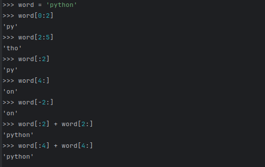

记住切片工作原理的一种方法是将索引想象为指向字符之间的位置，第一个字符的左边缘编号为 0。那么，一个长度为 n 的字符串的最后一个字符的右边缘索引为 n，例如：
 
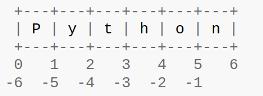

如果尝试索引超出字符串的长度会引发错误，但是切片优雅的解决了这个问题：

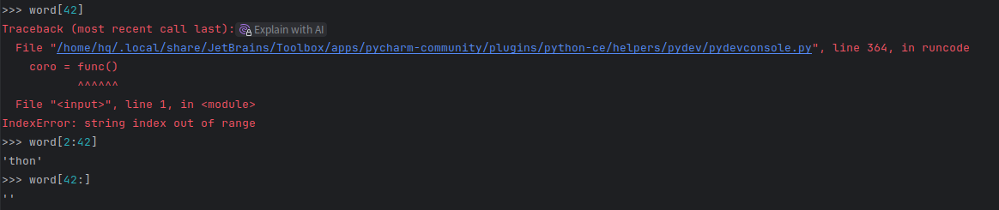

Python 字符串是不可变的，因此对字符串中的索引位置赋值会导致错误：    (不可变对象immutable object：字符串、数字、元组)

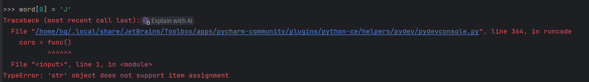

如果想要一个不同的字符串，你应该创建一个新的,内置函数 `len()`会返回字符串的长度：

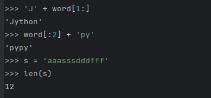

### 3.1.3 列表（list）

Python提供了多种符合数据类型，用于将其他值组合在一起。其中最灵活的是列表，列表可以写作方括号中以逗号分隔的值列表。列表可以包含不同类型的元素，但通常所有元素都具有相同的类型。

所有的内置序列类型（字符串、列表、元组、字节）都可以被索引和切片：

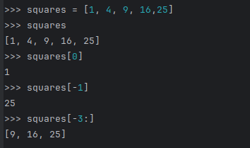

列表还支持像连接这样的操作:
```Py
>>> squares + [36, 49, 64, 81, 100]
[1, 4, 9, 16, 25, 36, 49, 64, 81, 100]
```
列表是可变类型，可以改变它的内容：
```Py
>>> cubes = [1, 8, 9, 65, 125]
>>> cubes[3] = 64
>>> cubes
[1, 8, 9, 64, 125]
```

可以使用list.append()方法在列表的尾部增加新元素：
```Py
>>> cubes.append(6 ** 3)
>>> cubes
[1, 8, 9, 64, 125, 216]
```

在 Python 中，简单的赋值从不复制数据。当你将一个列表赋值给一个变量时，该变量引用的是现有的列表。通过一个变量对列表所做的任何更改，都会通过所有其他引用它的变量显现出来:

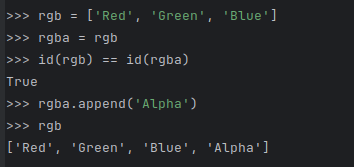

所有切片操作都会返回一个包含所请求元素的新列表。这意味着以下切片会返回列表的浅拷贝：

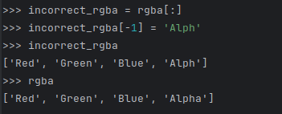

也可以对切片进行赋值，这甚至可以改变列表的大小或完全清空列表:

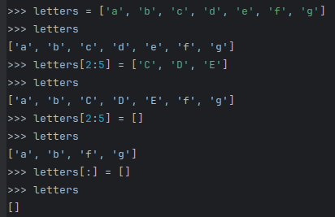

列表可以嵌套：

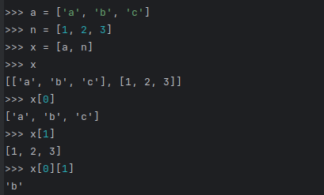

## 3.2 迈出编程第一步 (First Steps Towards Programming)

当然，我们可以用 Python 完成比两两相加更复杂的任务。例如，我们可以按照以下方式编写斐波那契数列的初始子序列：

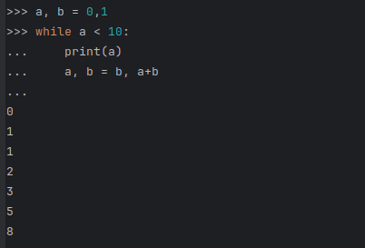

这个例子引入了几个新特性。

- 第一行包含了多重赋值：变量 a 和 b 同时获得了新值 0 和 1。在最后一行再次使用了这种方式，表明在任何赋值发生之前，右侧的所有表达式都会先被计算。右侧的表达式从左到右依次计算。
- while 循环会一直执行，只要条件（这里是 a < 10）保持为真。在 Python 中，和 C 语言一样，任何非零整数值都被视为真；零被视为假。条件也可以是字符串或列表值，实际上可以是任何序列；任何非零长度的序列为真，空序列为假。示例中使用的测试是一个简单的比较。标准比较运算符的写法与 C 语言相同：<（小于）、>（大于）、==（等于）、<=（小于等于）、>=（大于等于）和 !=（不等于）。
- 循环的主体是缩进的：缩进是 Python 分组语句的方式。在交互式提示符下，你必须为每一行缩进的代码输入一个制表符或空格。在实践中，你会使用文本编辑器为 Python 准备更复杂的输入；所有像样的文本编辑器都具备自动缩进功能。在交互式输入复合语句时，必须在最后跟一个空行来表示完成（因为解析器无法猜测你何时输入了最后一行）。注意，一个基本块内的每一行必须缩进相同的量。
- print() 函数会输出它所接收的参数值。它与直接编写你想输出的表达式（就像我们在早期的计算器示例中所做的那样）有所不同，区别在于它处理多个参数、浮点数和字符串的方式。字符串在输出时不带引号，并且各项之间会插入一个空格，这样你就可以很好地格式化输出，例如：

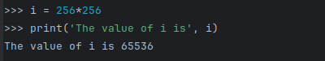

关键字参数 end 可以用来避免输出后的换行，或者以不同的字符串结束输出：

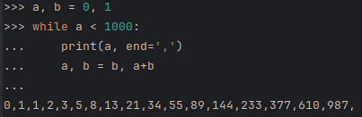

# 4. 更多控制流工具 (More Control Flow Tools)

除了刚刚介绍的while语句，Python还使用了一些其他的控制流语句，我们将在本章中遇到它们。

## 4.1 `if` 语句 (if Statements)

也许最广为人知的语句类型是if语句。例如：

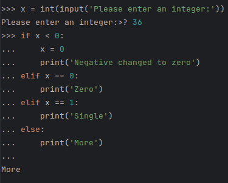

可以有零个或多个 elif 部分，而 else 部分是可选的。关键字 elif 是 else if 的缩写，有助于避免过多的缩进。if … elif … elif … 序列是其他语言中 switch 或 case 语句的替代品。

如果你将同一个值与多个常量进行比较，或者检查特定类型或属性，你可能会发现 match 语句很有用。更多详情请参见 match 语句。

## 4.2 `for` 语句 (for Statements)

Python 中的 for 语句与你在 C 或 Pascal 中可能习惯的有所不同。它并不总是遍历数字的算术序列（像 Pascal 那样），也不是让用户定义迭代步长和终止条件（像 C 那样），而是遍历任何序列（例如列表或字符串）的元素，按照它们在序列中出现的顺序。例如（无意双关）：

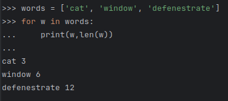

在迭代同一集合时修改该集合的代码可能会很难正确实现。相反，通常更直接的方法是遍历该集合的副本或创建一个新集合：

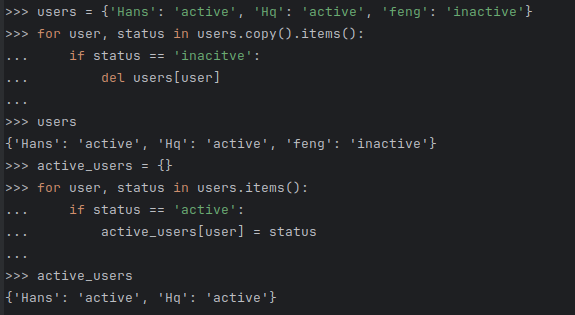

## 4.3 `range()` 函数 (The range() Function)

如果你确实需要遍历一个数字序列，内置函数 range() 会派上用场。它可以生成算术序列：

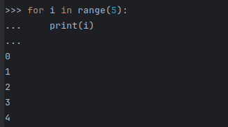

给定的终点从不包含在生成的序列中；range(10) 生成 10 个值，这些值是一个长度为 10 的序列的合法索引。可以让 range 从另一个数字开始，或者指定不同的增量（甚至可以是负数；有时这被称为“步长”）：

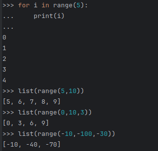

要遍历一个序列的索引，可以结合使用`range()`和`len()`,如下所示：

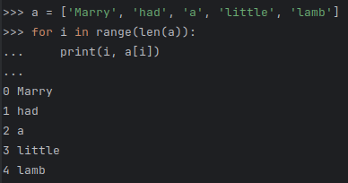

然而，在大多数这类情况下，使用 `enumerate() `函数会更方便，参见Looping Techniques循环技巧。

如果你只是打印一个`range`，会发生一件奇怪的事情：

```Py
>>> range(10)
range(0, 10)
```

在很多方面，range() 返回的对象表现得像一个列表，但实际上它并不是。它是一个对象，当你迭代它时，会返回所需序列的连续项，但它并不真正创建列表，从而节省空间。

我们称这样的对象为 可迭代的，也就是说，它适合作为期望从中获取连续项直到耗尽的目标对象，适用于某些函数和结构。我们已经看到，for 语句就是这样的结构，而一个接受可迭代对象的函数示例是 sum()：

```Py
>>> sum(range(4))
6
```
稍后我们将看到更多返回可迭代对象并接受可迭代对象作为参数的函数。在 数据结构 章节中，我们将更详细地讨论 list()。

## 4.4 `break` 和 `continue` 语句，以及循环中的 `else` 子句 (break and continue Statements, and else Clauses on Loops)

break 语句会跳出最内层的封闭 for 或 while 循环：

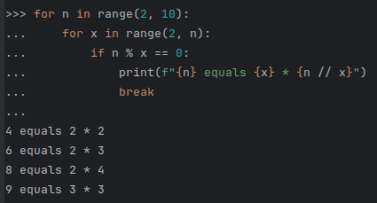

continue 语句会继续进行循环的下一次迭代：

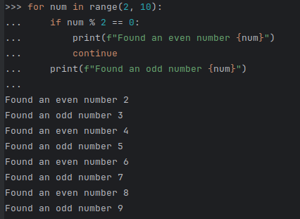

在 for 或 while 循环中，break 语句可以与 else 子句配对。如果循环完成而未执行 break，则 else 子句会被执行。

在for循环中，如果没有发生break，else子句会在循环完成其最后一次迭代后执行。
在while循环中，else子句会在循环条件变为假后执行。

在任何一种循环中，如果循环因break而终止，else语句都不会执行。当然，其他提前结束循环的方式，例如return或抛出的异常，也会跳过else子句的执行。

下面的 for 循环示例展示了这一点，它用于搜索素数：

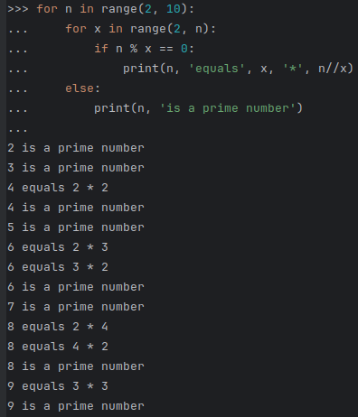

（是的，这是正确的代码。仔细看：else 子句属于 for 循环，而不是 if 语句。）

理解 else 子句的一种方法是想象它与循环内部的 if 配对。随着循环的执行，它会运行一个类似于 if/if/if/else 的序列。if 在循环内部，会被遇到多次。如果条件曾经为真，就会触发 break。如果条件从未为真，循环外的 else 子句将会执行。

## 4.5 `pass` 语句 (pass Statements)

pass 语句什么也不做。它可以在语法上需要语句但程序不需要任何操作时使用。例如：

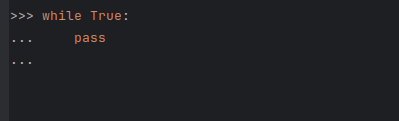

这通常用于创建最小的类：

```Py
>>> class MyEmptyClass:
...    pass  
...
```

pass 的另一个用途是在你编写新代码时，作为函数或条件体的占位符，让你可以继续在更抽象的层面上思考。pass 会被默默地忽略：

```Py
>>> def initlog(*args):
...     pass  
...
```

## 4.6 `match` 语句 (match Statements)

match 语句接受一个表达式，并将其值与一个或多个 case 块中给出的连续模式进行比较。这表面上类似于 C、Java 或 JavaScript（以及许多其他语言）中的 switch 语句，但它更类似于 Rust 或 Haskell 等语言中的模式匹配。只有第一个匹配的模式会被执行，并且它还可以将值中的组件（序列元素或对象属性）提取到变量中。

最简单的形式是将主体值与一个或多个字面量进行比较：

```Py
def http_error(status):
    match status:
        case 400:
            return 'Bad request'
        case 404:
            return 'Not found'
        case 418:
            return "I'm a teapot"
        case _:
            return  "Something's wrong with the internet"

```
注意最后一个块：“变量名” _ 充当通配符，永远不会匹配失败。如果没有案例匹配，则不会执行任何分支。

你可以使用 |（“or”）将多个字面量组合成一个模式：
```Py
case 401| 402 | 404:
    return "Not allowed"
```
模式可以看起来像解包赋值，并且可以用来绑定变量：

```py
match point:
    case (0, 0):
        print("Origin")
    case (0, y):
        print(f"Y={y}")
    case (x, 0):
        print(f"X={x}")
    case (x, y):
        print(f"X={x}, Y={{y}")
    case _:
        raise ValueError("Not a point")
```

仔细研究这个例子！第一个模式包含两个字面量，可以看作是上面所示字面量模式的扩展。但接下来的两个模式结合了一个字面量和一个变量，变量从主体（point）中绑定一个值。第四个模式捕获了两个值，这在概念上类似于解包赋值 (x, y) = point。

如果你使用类来组织数据，可以使用类名后跟一个类似于构造函数的参数列表，但能够将属性捕获到变量中：

```Py
class Point:
    def __init__(self, x, y):
        self.x = x
        self.y = y
        
def where_is(piont):
    match point:
        case Point(x=0, y=0):
            print("Origin")
        case Point(x=0, y=y):    
            print(f"Y={y}")
        case Point(x=x, y=0):
            print(f"X={x}")
        case Point():
            print("Somewhere else")
        case _:
            print("Not a point")        

```

你可以对一些提供属性顺序的内置类（例如数据类）使用位置参数。你还可以通过在类中设置 __match_args__ 特殊属性来为模式中的属性定义特定位置。如果它被设置为 ("x", "y")，以下模式都是等价的（并且都将 y 属性绑定到 var 变量）：

```Py
Point(1, var)
Point(1, y=var)
Point(x=1, y=var)
Point(y=var, x=1)
```

推荐的阅读模式的方法是将它们视为赋值左侧的扩展形式，以理解哪些变量会被设置为哪些值。只有独立的名称（例如上面的 var）会被 match 语句赋值。点号名称（例如 foo.bar）、属性名称（例如上面的 x= 和 y=）或类名（通过旁边的 (…) 识别，例如上面的 Point）永远不会被赋值。

模式可以任意嵌套。例如，如果我们有一个短的 Points 列表，并且添加了 __match_args__，我们可以这样匹配它：

```Py
class Point:
    __match__args = ('x', 'y')
    def __init__(self, x, y):
        self.x = x
        self.y = y 
        
match points:
    case []:
        print('No points')
    case [Point(0, 0)]:
        print("The origin")
    case [Point(x, y)]:
        print(f"Single point {x}, {y}")
    case [Point(0, y1), Point(0, y2)]:
        print(f"Two on the Y axis at {y1}, {y2}")
    case _:
        print("Something else")
```

我们可以在模式中添加一个 if 子句，称为“守卫”。如果守卫为假，match 会继续尝试下一个 case 块。请注意，值捕获在守卫被评估之前发生：

```Py
match point:
    case Point(x, y) if x == y:
        print(f"Y=X at {x}")
    case Point(x, y):
        print(f"Not on the diagonal")
```

match语句的几个其他关键特性：

- 与解包赋值类似，元组和列表模式的含义完全相同，并且实际上可以匹配任意序列。一个重要的例外是它们不匹配迭代器或字符串。
- 序列模式支持扩展解包：[x, y, *rest] 和 (x, y, *rest) 的工作方式类似于解包赋值。* 后的名称也可以是 _，因此 (x, y, *_) 匹配至少有两个项目的序列，而不绑定剩余的项目。
- 映射模式：{"bandwidth": b, "latency": l} 从字典中捕获 "bandwidth" 和 "latency" 值。与序列模式不同，多余的键会被忽略。也支持类似 **rest 的解包。（但 **_ 是多余的，因此不允许。）
- 子模式可以使用 as 关键字进行捕获：
  ```Py
  case (Point(x1, y1), Point(x2, y2) as p2):...
  ```
  将输入的第二个元素捕获为 p2（只要输入是两个点的序列）。
- 大多数字面量通过相等性进行比较，然而单例对象 True、False 和 None 是通过身份进行比较的。
- 模式可以使用命名常量。这些必须是点号名称，以防止它们被解释为捕获变量：
  ```Py
  from enum import Enum
  class Color(Enum):
      RED = 'red'
      GREEN = 'green'
      BLUE = 'blue'
  color = Color(input("Enter your choice of 'red', 'blue' or 'green': "))
  match color:
      case Color.RED:
          print("I see red!")
      case Color.GREEN:
          print("Grass is green")
      case Color.BLUE:
          print("I'm feeling the blues :(")
  ```


